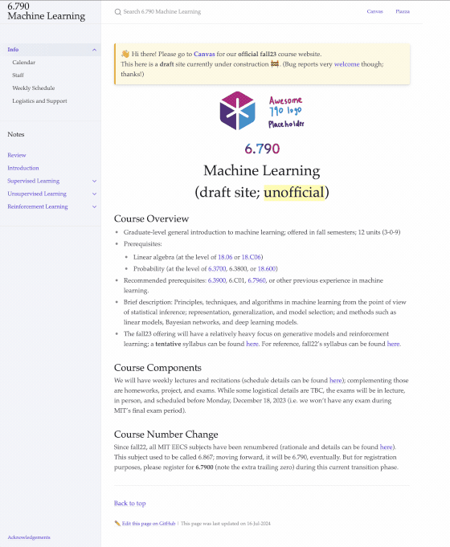

### Minor edits and the "Live" site

Minor edits like typo fixes can be made by following the `edit link` at the bottom of each [`gradML`](https://gradml.mit.edu) webpage.

Those with write access to this repository can edit directly via the GitHub webUI; a PR can be another approach. Content edits pushed to the `main` branch will be "live" on [`gradML`](https://gradml.mit.edu) within a few seconds. Other changes, like website infrastructure upgrades or feature changes, require a server-side reload.

Below is a quick demo of adding a "gradient vector" blob (commit [`c8d8c5d`](https://github.com/790gradml/gradML/commit/c8d8c5d15cce69b94a6ff0aa980f45e9d4c0cbc2))




### Site structure

The [`gradML`](https://gradml.mit.edu) website structure largely mirrors the file system structure (with a few exceptions, detailed later). Every `html` webpage is sourced from a `.md` markdown file. Any markdown file with a filename starting with `_` or located in a folder whose name starts with `_` is skipped and not turned into a webpage, e.g., no files under this `_docs` folder are rendered on [`gradML`](https://gradml.mit.edu).

Top-level navigational pages are placed in the root folder. For example, the site links to [https://gradml.mit.edu/review/](https://gradml.mit.edu/review/) on the homepage since the corresponding source [review.md](https://github.com/790gradml/gradML/blob/main/review.md) is located in the repo's root folder.

Lower-level structure is declared in the [`_config.yml`](https://github.com/790gradml/gradML/blob/main/_config.yml) file. For example, this blob
```yaml
- scope:
    path: "reinforcement/"
  values:
    parent: Reinforcement Learning
    layout: page
```
in the [`_config.yml`](https://github.com/790gradml/gradML/blob/37564ca75c73b216f16c1ef165721417ab78ed6b/_config.yml#L144) file tells the site to look for markdown files located in the `<repo root>/reinforcement` folder to organize the corresponding drop-down module. Similarly, under `<repo root>/supervised/`, the `learnability_and_vc.md` file is rendered as the `gradml.mit.edu/supervised/learnability_and_vc/` page.
