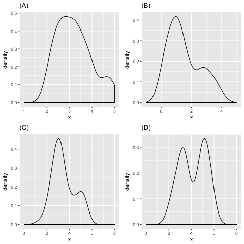

# Math Background

## Just plane fun

Consider a hyperplane in $n$-dimensional Euclidean space, described by
the $n+1$ real values $w_i$ for $i = 0, \ldots, n$: the hyperplane
consists of points $(x_1,\dots,x_n)$ satisfying
$$w_0 + w_1 x_1 + \ldots + w_n x_n = 0 \;\;.$$

Find a unit vector normal to the hyperplane. Given a point
${\bm{v}} = (v_1, \ldots, v_n)$ on the hyperplane, give
the equation for the line through the point that is orthogonal to the
hyperplane.

Let ${\bm{w}}=(w_1,\ldots,w_n)$, then
${\bm{w}}/\|{\bm{w}}\|$ is a unit vector
normal to the hyperplane. To prove this, given any two points
${\bm{x}}$ and ${\bm{x}}'$ on the hyper
plane, we will show that ${\bm{w}}$ is perpendicular to
${\bm{x}}-{\bm{x}}'$. Note
$${\bm{w}}^T({\bm{x}} - {\bm{x}}') = \sum_{i=1}^nw_ix_i - \sum_{i=1}^nw_ix'_i = (-w_0)-(-w_0) = 0$$
Therefore, all the points on the line through the point
${\bm{v}}=(v_1,\ldots,v_n)$ orthogonal to the hyperplane
could be represented as
${\bm{x}}={\bm{v}} + t{\bm{w}}$,
where $t\in\mathbb{R}$ is a parameter. The equation of this line could
be written as
$${\bm{A}}^T({\bm{x}} - {\bm{v}})={\bm{0}}$$
where matrix
${\bm{A}}=({\bm{a}}_1,\ldots,{\bm{a}}_{n-1})\in\mathbb{R}^{n\times (n-1)}$
is a basis for the subspace associated with the hyperplane. This
equation means that for any vector ${\bm{x}}$ on this
line, ${\bm{x}}-{\bm{v}}$ must be
orthogonal to all the basis vectors in the hyperplane. The choice of
${\bm{A}}$ is not unique. One concrete way of getting it
is: let ${\bm{e}}_1,\ldots,{\bm{e}}_n$ be
standard basis for $\mathbb{R}^n$. Choose $n-1$ from them by first
taking all ${\bm{e}}_i$ such that
${\bm{e}}_i^T{\bm{w}}=0$ (note there are
at most $n-1$ of them); the rest of them could be taken arbitrarily.
Denote the chosen vectors by
$\tilde{\bm{e}}_1,\ldots,\tilde{\bm{e}}_{n-1}$,
then
$${\bm{a}}_i=\tilde{\bm{e}}_i - \left(\tilde{\bm{e}}_i^T{\bm{w}}\right){\bm{w}}, \quad i=1,\ldots,n-1$$

Given a point ${\bm{v}} = (v_1, \ldots, v_n)$, how can
you determine which side of the hyperplane it is on?

Let
$f({\bm{x}}) = w_0 + {\bm{w}}^T{\bm{x}} = w_0 + w_1x_1 + \cdots + w_nx_n$.
Then $f({\bm{v}}) =
            0$ means ${\bm{v}}$ is on the hyperplane;
$f({\bm{v}}) > 0$ means ${\bm{v}}$ is on
one side of the hyperplane, while $f({\bm{v}})<0$ means
it is on the other side of the hyperplane.

What is the distance of a point
${\bm{v}}=(v_1, \ldots, v_n)$ to the hyperplane?

Assume $\bar{\bm{v}}$ is the projection of
${\bm{v}}=(v_1,\ldots,v_n)$ on the hyperplane. Since
${\bm{w}}/\|{\bm{w}}\|$ is the unit normal
vector of the hyperplane, we know that
$${\bm{v}} = \bar{\bm{v}} + t\frac{\bm{w}}{\|{\bm{w}}\|}$$
where $|t|$ is the distance of ${\bm{v}}$ to the
hyperplane. We also know $f(\bar{\bm{v}})=0$ by the
previous question, that means
$$0 = f(\bar{\bm{v}}) = f\left({\bm{v}}-t\frac{\bm{w}}{\|{\bm{w}}\|}\right)
            = w_0 + {\bm{w}}^T{\bm{v}} - t\frac{\bm{w}^T{\bm{w}}}{\|{\bm{w}}\|} = w_0 + {\bm{w}}^T{\bm{v}} - t\|{\bm{w}}\|$$
Therefore, the distance is given by
$$|t| = \left| \frac{w_0 + {\bm{w}}^T{\bm{v}}}{\|{\bm{w}}\|} \right|
            = \frac{\left| f({\bm{v}}) \right|}{\|{\bm{w}}\|}$$

Consider the halfspace
$H=\{\bm{x} \in \mathbb{R}^n \mid {\bm{w}}^T{\bm{x}} \le b\}$.
Find a nearest (in Euclidean distance) point in $H$ to a given vector
${\bm{v}}=(v_1,v_2,\ldots,v_n)$. Is this point unique?
Hint: Consider combining the Euclidean distance and the constraint into
a single function to optimize by using a Lagrangian multiplier.

We need to solve the problem:
$\min_{\bm{x} \in H}\|{\bm{x}}-{\bm{v}}\|^2$.
Using a Lagrangian multiplier $\lambda \ge 0$ for the constraint
${\bm{w}}^T{\bm{x}} \le b$ we consider
$$L({\bm{x}},\lambda) = \tfrac12\|{\bm{x}}-{\bm{v}}\|^2 + \lambda({\bm{w}}^T{\bm{x}}-b).$$
Now solve $\partial L/\partial {\bm{x}}=0$ to obtain
${\bm{x}}-{\bm{v}} + \lambda{\bm{w}}=0$,
so that
${\bm{x}}={\bm{v}}-\lambda{\bm{w}}$.
If ${\bm{v}} \in H$, then we can set $\lambda=0$.
Otherwise, any solution ${\bm{x}}$ must lie on the
boundary of the halfspace $H$, and satisfy
${\bm{w}}^T{\bm{x}}=b$. From
${\bm{x}}={\bm{v}}-\lambda {\bm{w}}$
it follows that
${\bm{x}}^T{\bm{w}}={\bm{v}}^T{\bm{w}}-\lambda {\bm{w}}^T{\bm{w}}$,
which gives
$\lambda=\frac{1}{\|{\bm{w}}\|^2}({\bm{v}}^T{\bm{w}}-b)$.
We can thus write the solution (it is unique) as
$${\bm{x}} = {\bm{v}} - \frac{1}{\|{\bm{w}}\|^2}\max(0, {\bm{v}}^T{\bm{w}}-b){\bm{w}}.$$

## Multivariate Gaussian

Let $X$ be a random variable taking values in $\mathbb{R}^n$. It is
normally distributed with mean $\bm{\mu}$ and covariance matrix
$\Sigma$. Recall that the probability density function (pdf)
$p_X({\bm{x}})$, sometimes denoted
$p(X={\bm{x}})$, for $X$ is given by
$$p_X({\bm{x}}) = \frac{1}{\sqrt{(2\pi)^n|\Sigma|}} \exp\left(-\frac{1}{2}({\bm{x}}-\bm{\mu})^T\Sigma^{-1}({\bm{x}}-\bm{\mu})\right)$$

Show how to obtain the normalization constant
$1 / \sqrt{(2\pi)^n|\Sigma|}$ for the multivariate Gaussian, starting
from the fact that
$$p_X({\bm{x}}) \propto \exp\left(-\frac{1}{2}({\bm{x}}-\bm{\mu})^T\Sigma^{-1}({\bm{x}}-\bm{\mu})\right)$$

To obtain the normalization constant we need to evaluate the integral
$$\int_{\mathbb{R}^n} \exp\left(-\frac{1}{2}({\bm{x}}-\bm{\mu})^T\Sigma^{-1}({\bm{x}}-\bm{\mu})\right)d{\bm{x}}.$$
Observe that wlog we can assume $\bm{\mu}=0$. Thus, it remains to
evaluate

$$\int_{\mathbb{R}^n} \exp\left(-\tfrac{1}{2}{\bm{x}}^T\Sigma^{-1}{\bm{x}}\right)d{\bm{x}}$$

 Let
${\bm{y}} = \Sigma^{-1/2} {\bm{x}}$, then
by Jacobian
transformation <a href="#1_2_2_num" data-reference-type="eqref"
data-reference="1_2_2_num">[1_2_2_num]</a> can be rewritten as
$$\begin{aligned}
            \int_{\mathbb{R}^n} \exp\left(-\tfrac{1}{2}{\bm{y}}^T{\bm{y}}\right)|\Sigma^{1/2}|d{\bm{y}} & = |\Sigma^{1/2}|\prod^n_{i=1}\int_{\mathbb{R}}\exp\left(-\tfrac{1}{2}y^2_i\right) dy_i \\
                                                                                              & = |\Sigma^{1/2}|\prod^n_{i=1} \sqrt{2 \pi}
        
\end{aligned}$$ We use the fact that
$\int_{\mathbb{R}}\exp(-\frac{1}{2}x^2) = \sqrt{2 \pi}$, then using the
fact that $\int p({\bm{x}}) = 1$, we conclude that the
normalization constant is $\frac{1}{\sqrt{(2\pi)^n|\Sigma|}}$.

Let $Y = 2 X$. What is the pdf of $Y$?

By the rule of probability density function for change of variable,
$$\begin{aligned}
                p_Y({\bm{y}}) & = \left(\frac{1}{2}\right)^n \frac{1}{\sqrt{(2\pi)^n|\Sigma|}}
                \exp\left(-\frac{1}{2}\left(\frac{\bm{y}}{2}-\mu\right)^T\Sigma^{-1}\left(\frac{\bm{y}}
                {2}-\mu\right)\right)                                                         \\
                             & = \frac{1}{\sqrt{(2\pi)^n|4\Sigma|}}
                \exp\left(-\frac{1}{2}\left({\bm{y}}-2\mu\right)^T\left(4\Sigma^{-1}\right)\left({\bm{y}}
                    -2\mu\right)\right)
            \end{aligned}$$ So $Y$ is still normally distributed, with
mean $2\mu$ and covariance matrix $4\Sigma$.

What can we say about the distribution of $X$ if $\Sigma$ is the
identity matrix, $I$? Does this imply anything about factorization of
the pdf?

When $\Sigma$ is the identity matrix,
$$p_X({\bm{x}}) = \frac{1}{\sqrt{(2\pi)^n}}\exp\left(-\frac{1}{2}\sum_{i=1}^n (x_i-\mu_i)^2\right)
            = \prod_{i=1}^n \frac{1}{\sqrt{2\pi}}\exp\left(-\frac{1}{2}(x_i-\mu_i)^2\right)$$
The factorization of the pdf implies that $X_1,\ldots,X_n$ are now
independent random variables.

What can we say about the distribution of $X$ if $\Sigma$ is $5 I$?

$X_1,\ldots,X_n$ are still independent. In general, let $\sigma\neq 0$
be any real number, if $\Sigma=\sigma^2 I$, then
$$p_X({\bm{x}}) = \frac{1}{\sqrt{(2\pi)^n\sigma^{2n}}}\exp\left(-\frac{1}{2\sigma^2}\sum_{i=1}^n
            (x_i-\mu_i)^2\right)
            = \prod_{i=1}^n \frac{1}{\sqrt{2\pi}\sigma}\exp\left(-\frac{1}{2\sigma^2}(x_i-\mu_i)^2\right)$$

What can we say about the distribution of $X$ if $\Sigma$ is
$\begin{bmatrix} 10 & 0 \\ 0 & 1 \end{bmatrix}$

Although the covariance matrix is not a (scaled) identity matrix, the
off-diagonal elements are still zero, so the two components of the 2D
random vector are still independent and the pdf factorizes.
Specifically, we have
$$p_X({\bm{x}}) = \frac{\exp\left(-\frac{1}{2\times 10}(x_1-\mu_1)^2\right)}{\sqrt{2\pi\times 10}}
            \cdot \frac{\exp\left(-\frac{1}{2}(x_2-\mu_2)^2\right)}{\sqrt{2\pi}}$$

Approximately what shape do equiprobability contours (i.e., sets
$\{x\in R^n: p_X(x)=c\}$ for some $c$) of the above distribution in Part
5 have?

Let
$$c = p_X({\bm{x}}) = \frac{\exp\left(-\frac{1}{2\times 10}(x_1-\mu_1)^2\right)}{\sqrt{2\pi\times 10}}
            \cdot \frac{\exp\left(-\frac{1}{2}(x_2-\mu_2)^2\right)}{\sqrt{2\pi}}$$
Via simple manipulation, we get the equation
$$\frac{1}{10}(x_1-\mu_1)^2 + (x_2-\mu_2)^2 = C$$ where $C>0$ is a
constant. This is a ellipse in $\mathbb{R}^2$ centered at $\mu$.
Specifically, the contours look like those:

<embed src="./figures/q6.pdf" />

What can we say about the distribution of $X$ if $\Sigma$ is
$\begin{bmatrix}
            10 & -4 \\ -4 & 10
        \end{bmatrix}$

This is a 2D normally distributed random vector. The two components are
(negatively) correlated.

Approximately what shape do equiprobability contours of the distribution
in Part 7 have?

Similarly, let $p_X({\bm{x}}) = c$, we will get an
equation of an ellipse. The contours for this specific case look like
those:

<embed src="./figures/q9.pdf" />

Is $\begin{bmatrix}
            2 & 10 \\ 10 & 2
        \end{bmatrix}$ a valid $\Sigma$? How can you tell?

No, because it is not positive semi-definite.

If $\mu = (1, 2)$, and $\Sigma = \begin{bmatrix}
            10 & 0 \\ 0 & 1
        \end{bmatrix}$, what is the conditional pdf
$p_{X_1|X_2}(x_1 \mid 3)$?

Note there is no correlation between $X_1$ and $X_2$, so they are
independent. In this case, conditioning on $X_2$ does not change the
distribution of $X_1$, which is a normally distributed random variable
with mean $1$ and variance $10$.

## Probability

Let $A, B$ be $p \times q$ matrices and $x$ be a random $q \times 1$
vector. Prove that
$$\operatorname{cov}(A x, B x)=A \operatorname{cov}(x) B^{T}$$ where
$\operatorname{cov}(u, v)=E\left[(u-E[u])(v-E[v])^{T}\right]$ is the
cross-covariance matrix between random vectors $u$ and $v$, while
$\operatorname{cov}(u)=E\left[(u-E[u])(u-E[u])^{T}\right]$ is the
covariance matrix for $u$.

$$\begin{aligned}
                \operatorname{cov}(A x, B x) & =E\left[(A x-E[A x])(B x-E[B x])^{T}\right]  \\
                                             & =E\left[A(x-E[x])(B(x-E[x]))^{T}\right]      \\
                                             & =E\left[A(x-E[x])(x-E[x])^{T} B^{T}\right]   \\
                                             & =A E\left[(x-E[x])(x-E[x])^{T}\right] B^{T}  \\
                                             & =A \cdot \operatorname{cov}(x) \cdot B^{T} .
            \end{aligned}$$

You go for your annual checkup and have several lab tests performed. A
week later your doctor calls you and says she has good and bad news. The
bad news is that you tested positive for a marker of a serious disease,
and that the test is 97% accurate (i.e. the probability of testing
positive given that you have the disease is 0.97, as is the probability
of testing negative given that you don’t have the disease). The good
news is that this is a rare disease, striking only 1 in 20,000 people.
What are the chances that you actually have the disease?

Let $A$ be the event of you having the disease and $B$ be the event of
testing positive. By Bayes rule we have:
$$P(A|B)=\frac{P(B|A)P(A)}{P(B|A)P(A)+P(B|\neg A)P(\neg A)} \\
            = \frac{0.97\cdot0.00005}{0.97\cdot 0.00005 + 0.03\cdot 0.99995}  \approx 0.0016$$

Consider the following generative process describing the joint
distribution
$p(Z,X): Z \sim \text{Bernoulli}(0.2), X \sim \text{Gaussian}(\mu_Z, 0.5)$,
where $\mu_0=3$ and $\mu_1=5$. Which of the following plots is the
marginal distribution $p(X)$?

The marginal distribution of $X$ is given by:
$$p(X) = p(Z=0)p(X|Z=0) + p(Z=1)p(X|Z=1) = 0.8 \cdot \mathcal{N}(3, 0.5) + 0.2 \cdot \mathcal{N}(5, 0.5).$$
Hence, the solution is (C).

Alice and Bob were driving through a tunnel while listening to the
Billion-dollar lottery drawing live on the radio. Due to the signal
issue, they couldn’t hear the last number perfectly clear. Alice and Bob
think the number was $A$ and $B$, respectively. Is $A$ independent of
$B ?$ Is $A$ independent of $B$ given the true lottery number $T$?

$A$ is not independent of $B$. Because for example, the chance of $B=30$
is very high if $A=13$; much higher than if we knew nothing about $A$.
In other words, $P(B)!=P(B|A).$ By similar reasoning, $P(B|T)=P(B|T,A),$
and therefore $A$ is independent of $B$ given the true lottery number.

## Multivariate calculus

Find the minimum value of the function
$f(x,y) = x^2 + 2y^2 -xy + x - 4y \,$ over ${\mathbb R}^2$.

First observe that $f$ grows to $+\infty$ as $|x| \rightarrow \infty$
and $|y| \rightarrow \infty$, so $f$ must attain a minimum value at some
point in ${\mathbb R}^2$. This global minimum will also be a local
minimum, so it can be found using the first derivative test.  
To prove the first statement, we can write $f$ as: $$\begin{aligned}
            f(x,y) & = x^2 + 2y^2 -xy + x - 4y                                          \\
                   & = \left( \frac{x}{2} - y \right)^2 + \frac{3}{4}x^2 + y^2 + x - 4y \\
                   & \geq \frac{3}{4}x^2 + y^2 + x - 4y
        
\end{aligned}$$

Since the quadratic terms have strictly positive coefficients, the
function goes to $+\infty$ in all directions. Now, computing partial
derivatives:

$$\frac{\partial f}{\partial x}(x,y) = 2x - y + 1$$
$$\frac{\partial f}{\partial y}(x,y) = 4y - x - 4$$

Setting partial derivatives to 0, $$2x_0 - y_0 + 1 = 0$$
$$4y_0 - x_0 - 4 = 0$$

Solving these equations, we get $x_0 = 0$, $y_0 = 1$.  
So far, we only know that this is a zero derivative point, it could be
either a local maxima, or minima, or a saddle point. Normally we would
compute the Hessian to resolve this. But since we argued earlier that
the function must have a global minima, and there is only one zero
derivative point, the local minima has to be the global minima.
Therefore the global minimum value of $f$ is $f(x_0, y_0) = -2$.

Prove that $f(x,y)$ is convex over ${\mathbb R}^2$ by showing that its
Hessian is positive semi-definite.

Since the function is twice differentiable, it is convex if and only if
its Hessian matrix is positive semi-definite. We therefore compute the
Hessian matrix, which is defined as: $$H =
            \begin{bmatrix}
                \frac{\partial^2 f}{\partial x^2}          & \frac{\partial^2 f}{\partial x \partial y} \\[6 pt]
                \frac{\partial^2 f}{\partial x \partial y} & \frac{\partial^2 f}{\partial y^2}
            \end{bmatrix}$$

Computing, $$\begin{aligned}
            \frac{\partial f}{\partial x}(x,y) \quad         & = \quad  2x - y + 1 \\
            \frac{\partial f}{\partial y}(x,y) \quad         & = \quad  4y - x - 4 \\
            \frac{\partial^2 f}{\partial x^2} \quad          & = \quad 2           \\
            \frac{\partial^2 f}{\partial x \partial y} \quad & = \quad -1          \\
            \frac{\partial^2 f}{\partial y^2} \quad          & = \quad 4
        
\end{aligned}$$

Hence, $$H =
            \begin{bmatrix}
                2  & -1 \\
                -1 & 4
            \end{bmatrix}$$

It is easy to see that $H$ is positive definite since it is diagonally
dominant. Alternatively, we can compute its eigenvalues, $\lambda_1$ and
$\lambda_2$: $$\begin{aligned}
            \lambda_1 + \lambda_2     & = \text{trace}(H) = 6 \\
            \lambda_1 \cdot \lambda_2 & = \text{det}(H) = 7
        
\end{aligned}$$

Solving, $\lambda_1 = 3+\sqrt{2}$ and $\lambda_2 = 3- \sqrt{2}$. Since
these are both positive, $H$ is positive definite. Hence $f$ is convex
over ${\mathbb R}^2$.

*Note:* Here’s a handy tool for quickly (sanity) check your matrix
calculus <http://matrixcalculus.org/>.